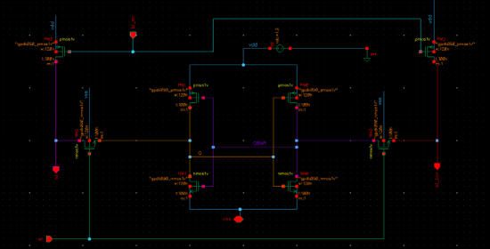
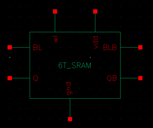
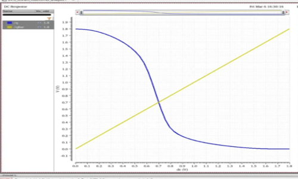

# SRAM Performance Analysis using Cadence Virtuoso

## Overview

This project presents the design, simulation, and analysis of a 6T SRAM cell using Cadence Virtuoso. The SRAM cell was implemented and characterized in both 90nm (gpdk090) and 180nm (gpdk180) CMOS technology nodes.

The work includes:

* Voltage Transfer Characteristic (VTC) Analysis
* Static Noise Margin (SNM) Analysis
* Read and Write Transient Simulations
* Stacking Effect for Leakage Reduction
* Power Consumption Analysis
* Layout Design and Verification
* Read-Write Block Design using Tristate Inverter
* Latch-Type Sense Amplifier Design
* Comparative Analysis of 90nm and 180nm Technologies

---

## Design Methodology

Cadence Virtuoso and Spectre Simulator were used for schematic capture, simulation, and layout design.

Technology Nodes:

* gpdk090 (90nm)
* gpdk180 (180nm)

Analysis Performed:

* DC Analysis
* Transient Analysis
* Power Analysis
* SNM Analysis
* Layout Verification

---

## 6T SRAM Cell – 90nm

### Schematic

### Symbol

### Voltage Transfer Characteristic (VTC)

### Butterfly Curve (SNM)

### Read Operation with Precharge

### Stacking Effect Analysis

### Power Analysis

---

## 6T SRAM Cell – 180nm

### Schematic

### Write Operation

### Voltage Transfer Characteristic

### Butterfly Curve

### Layout

### Transient Analysis

### Power Analysis

### Average Power Calculation

---

## Read-Write Block using Tristate Inverter

### NOT CMOS Gate

### NOT CMOS Symbol

### Tristate Inverter

### Tristate Symbol

### Read Write Block

### Read Write Symbol

### Full Read Write Simulation

---

## Latch-Type Sense Amplifier

### Symbol

### Schematic

---

## Comparative Analysis

| Parameter           | 90nm    | 180nm  |
| ------------------- | ------- | ------ |
| VDD                 | 1.2V    | 1.8V   |
| Switching Threshold | ~0.70V  | ~0.75V |
| Leakage             | Higher  | Lower  |
| Dynamic Power       | Lower   | Higher |
| SNM                 | Smaller | Larger |
| Density             | Higher  | Lower  |

---

## Key Findings

* Positive SNM was observed in both technology nodes.
* 180nm exhibited higher noise immunity and larger SNM.
* 90nm achieved higher density and lower dynamic power.
* Stacking significantly reduced leakage current.
* The SRAM cell successfully performed write, hold, precharge, and read operations.

---

## Tools Used

* Cadence Virtuoso
* Spectre Simulator
* gpdk090
* gpdk180

---

## Report

The complete project report is available in the `reports` folder.
