# SRAM Performance Analysis using Cadence Virtuoso

## Overview

This project presents the design and performance analysis of a 6T SRAM cell using Cadence Virtuoso. The SRAM cell was implemented and analyzed in both 90nm and 180nm CMOS technologies.

### Objectives

* Analyze Static Noise Margin (SNM)
* Study Read and Write Operations
* Evaluate Power Consumption
* Investigate Leakage Reduction using Stacking
* Compare 90nm and 180nm Technologies
* Design Read-Write Block and Sense Amplifier

---

## Tools Used

* Cadence Virtuoso
* Spectre Simulator
* gpdk090 Technology
* gpdk180 Technology

---

# 90nm SRAM Analysis

## SRAM Schematic

## SRAM Symbol

## Voltage Transfer Characteristic (VTC)

## Butterfly Curve (SNM)

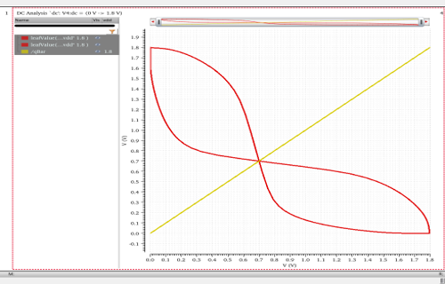

## Read Operation with Precharge

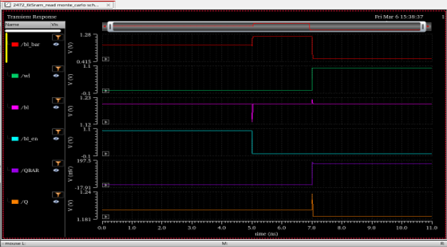

## Stacking Effect Circuit

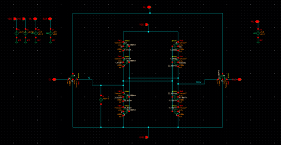

## Stacking Effect Analysis

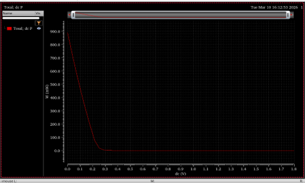

## Power Analysis

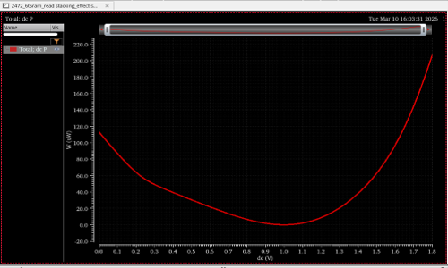

---

# 180nm SRAM Analysis

## SRAM Schematic

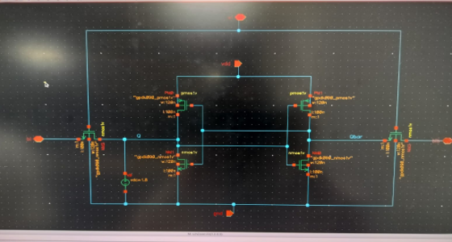

## Write Operation

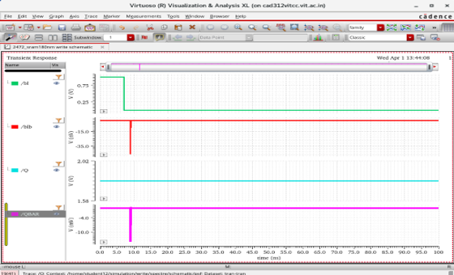

## Voltage Transfer Characteristic

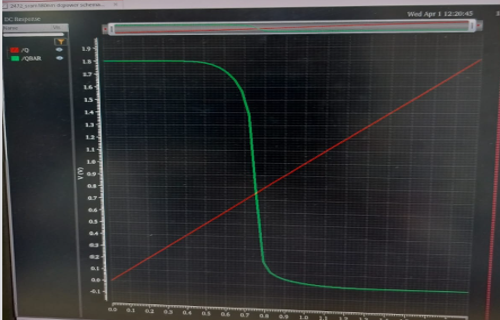

## Butterfly Curve

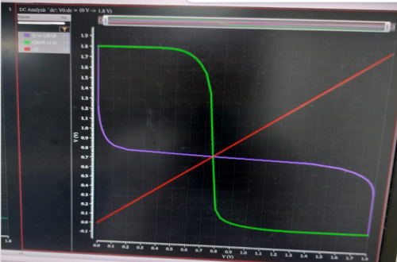

## Layout Design

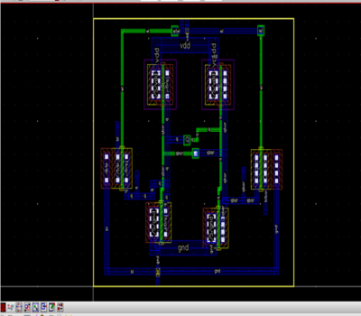

## Transient Analysis

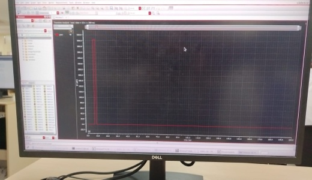

## Power Analysis

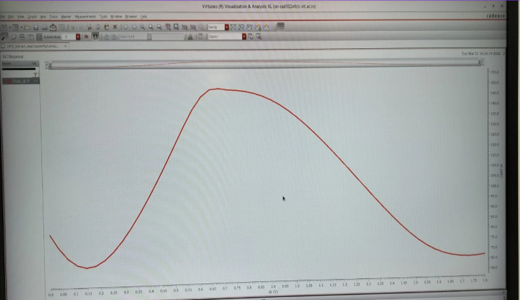

## Average Power Calculation

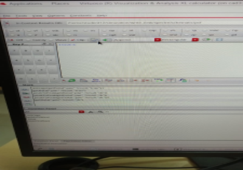

---

# Read-Write Block Design

## CMOS NOT Gate

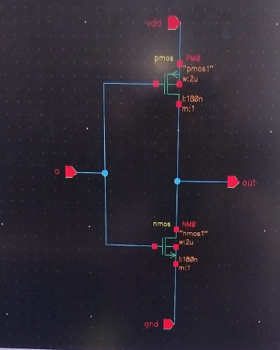

## CMOS NOT Symbol

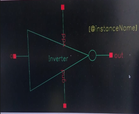

## Tristate Inverter

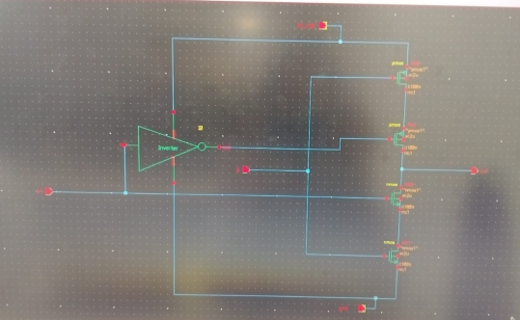

## Tristate Inverter Symbol

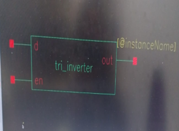

## Read-Write Block

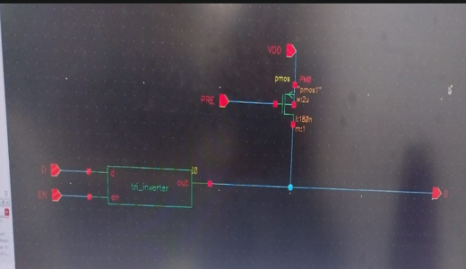

## Read-Write Block Symbol

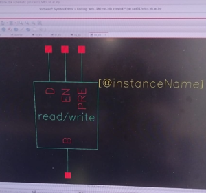

## Read-Write Operation Simulation

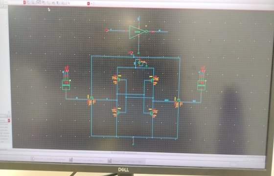

---

# Sense Amplifier Design

## Sense Amplifier Symbol

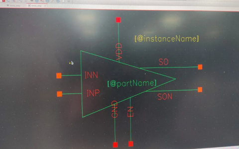

## Sense Amplifier Schematic

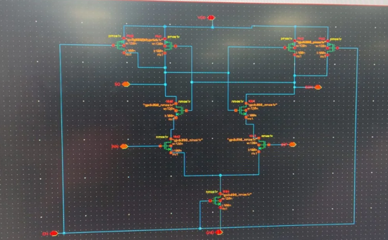

---

# Comparative Analysis

| Parameter       | 90nm Technology | 180nm Technology |
| --------------- | --------------- | ---------------- |
| Supply Voltage  | 1.2V            | 1.8V             |
| Device Density  | Higher          | Lower            |
| Leakage Current | Higher          | Lower            |
| Dynamic Power   | Lower           | Higher           |
| Noise Margin    | Lower           | Higher           |
| Area            | Smaller         | Larger           |

---

# Key Findings

* The 6T SRAM cell successfully performs read, write, and hold operations.
* Static Noise Margin was verified using butterfly curve analysis.
* Stacking effect reduces leakage current significantly.
* 180nm technology provides better stability and larger SNM.
* 90nm technology provides higher density and reduced area.
* Trade-offs exist between stability, power, and scalability.

---

# Report

The complete project report is available in:

`reports/SRAM_Final_Report.pdf`
